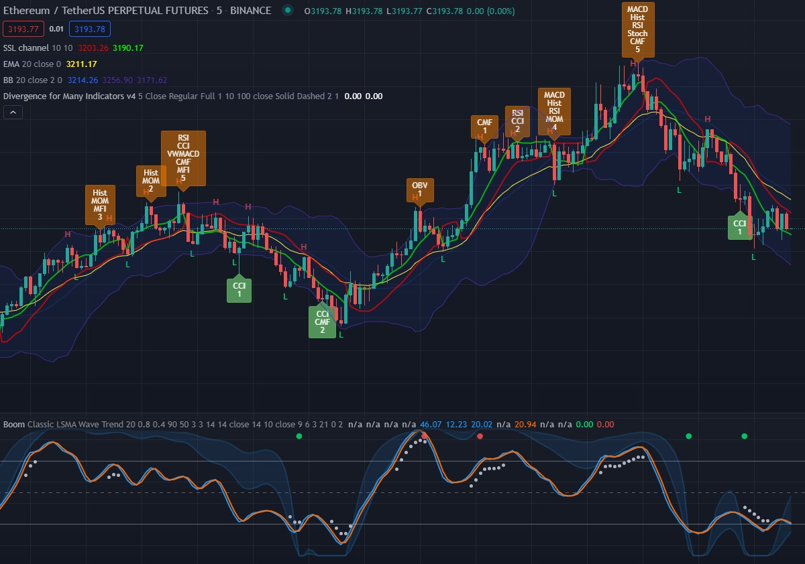

## Automated Trading View Alerts
Get automated trading view alerts on telegram via Divergence for many indicator v4. Divergence signals tend to be more accurate on the longer time frames. You get fewer false signals. This means fewer trades but if you structure your trade well, then your profit potential can be huge. Divergences on shorter time frames will occur more frequently but are less reliable.
## Graph Analysis Via TradingView Pine Script

   

## Signal Forward On Divergence Script Trigger Condition

   

